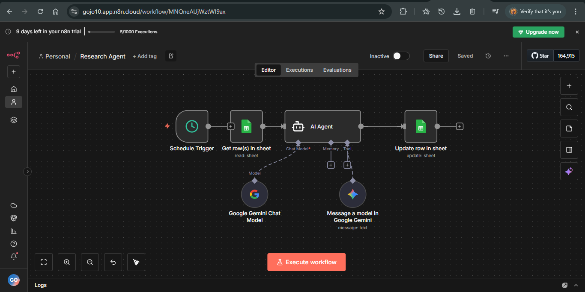

# AI Research & Summary Agent

This project is an Agentic AI workflow designed to automate online research and convert it into clear, structured summaries.

## Problem

Online research is time-consuming and repetitive.  
Finding relevant articles, reading long content, and extracting key points often takes hours for a single topic.

This project aims to automate that entire process using an agent-style workflow.

## How It Works

The agent follows a human-like research flow:

1. Topic is provided as input  
2. Agent searches the web for relevant articles  
3. Content is fetched and processed  
4. Key insights are identified  
5. A structured summary is generated using AI  
6. Final output is saved to Google Docs or delivered via email  

## Workflow Logic

search → read → reason → summarize → store

The workflow is designed to run end-to-end without manual intervention.

## Tools Used

- n8n (workflow orchestration)
- Google Gemini (content analysis and summarization)
- HTTP Requests (fetching web content)
- Google Docs / Sheets (output storage)
- Email integration

## Outcome

- Reduced research time significantly
- Created a reusable automation workflow
- Demonstrated agentic behavior through task planning and tool usage
- Built a foundation for more advanced autonomous agents

## Future Improvements

- Source ranking and filtering
- Memory for previously researched topics
- Multi-document comparison
- Scheduled research runs

---

> This is a self-initiated learning project focused on agentic AI and workflow automation.
